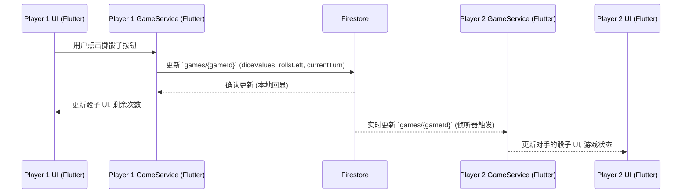
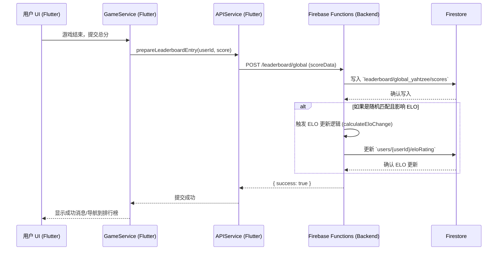

# 系统架构设计 - Yahtzee 游戏

本文档详细介绍了 Yahtzee 风格 Flutter 游戏的系统架构。

## 1. 整体组件图

```mermaid
graph TD
    A[Flutter 客户端 (Frontend)] -->|API 请求 (HTTPS/WebSocket)| B(后端服务器)
    B -->|读/写数据| C(数据库)
    A -->|本地存储| D(设备存储 - 个人最佳记录/设置)
```

## 2. 前端 (Flutter) 架构

### 2.1. 关键模块/目录

建议的目录结构如下：

*   `lib/`
    *   `main.dart`: 应用入口。
    *   `app.dart`: 根 widget，处理主题、路由等。
    *   `core_logic/`: 包含核心游戏逻辑，独立于 UI。
        *   `dice_roller.dart`
        *   `scoring_rules.dart`
        *   `game_state.dart` (游戏状态模型，例如当前玩家、回合、骰子值、已选分数等)
    *   `models/`: 数据模型。
        *   `user_model.dart`
        *   `score_model.dart`
        *   `game_model.dart` (可能包含 `GameState` 的实例以及其他游戏元数据)
        *   `leaderboard_entry_model.dart`
    *   `services/`: 与后端 API 和本地存储的交互。
        *   `api_service.dart` (用于网络请求)
        *   `local_storage_service.dart` (用于存储个人最佳记录、用户偏好等)
        *   `game_service.dart` (协调游戏逻辑和 UI 更新，可能与状态管理集成)
        *   `auth_service.dart` (如果需要用户账户)
    *   `ui_screens/`: 应用的各个屏幕/页面。
        *   `home_screen.dart`
        *   `game_screen.dart` (包含游戏板、骰子、分数表)
        *   `settings_screen.dart`
        *   `leaderboard_screen.dart`
        *   `matchmaking_screen.dart`
        *   `friend_battle_screen.dart`
    *   `widgets/`: 可重用的 UI 组件。
        *   `dice_widget.dart`
        *   `scoreboard_widget.dart`
        *   `player_avatar_widget.dart`
        *   `custom_button_widget.dart`
    *   `utils/`: 辅助函数和常量。
        *   `constants.dart`
        *   `helpers.dart`
    *   `navigation/`: 路由和导航逻辑。
        *   `app_router.dart` (使用 GoRouter 或类似的包)
    *   `state_management/`: (根据所选的状态管理方法)
        *   `providers/` (如果使用 Provider/Riverpod)
        *   `blocs/` (如果使用 BLoC)

### 2.2. 状态管理

**推荐：Riverpod**

**理由：**

*   **编译时安全：** 与 Provider 相比，减少了运行时错误。
*   **可测试性：** 易于模拟和测试。
*   **灵活性：** 支持多种类型的 Provider，可以很好地适应不同的需求。
*   **声明式：** 代码更易于阅读和理解。
*   **无需 `BuildContext`：** 可以在服务层或业务逻辑层中访问 Provider，而无需传递 `BuildContext`。
*   **性能：** 提供了细粒度的重建控制，有助于优化性能。

BLoC 也是一个强大的选择，但对于中小型项目，Riverpod 通常更简洁，学习曲线更平缓。Provider 虽然简单，但在大型应用中可能会变得难以管理。

### 2.3. 导航策略

**推荐：GoRouter**

**理由：**

*   **声明式路由：** 基于路径的路由，易于理解和管理。
*   **深度链接：** 支持 Web 和移动应用的深度链接。
*   **类型安全路由 (通过代码生成)：** 可以生成类型安全的路由，减少错误。
*   **易于处理复杂的导航场景：** 如嵌套路由、重定向等。
*   **与 Flutter 团队紧密集成。**

## 3. 后端架构

考虑到需要实时功能 (如双人对战) 和排行榜/ELO 系统，后端是必需的。

### 3.1. 技术栈

**推荐：Firebase** (包括 Firestore, Firebase Functions, Firebase Authentication)

**理由：**

*   **快速开发：** Firebase 提供了许多后端即服务 (BaaS) 功能，可以显著加快开发速度。
*   **实时数据库 (Firestore/Realtime Database)：** 非常适合双人游戏的实时状态同步和排行榜更新。Firestore 具有更好的可伸缩性和查询能力。
*   **无服务器函数 (Firebase Functions)：** 用于实现自定义后端逻辑，如 ELO 计算、匹配撮合、API 端点等，无需管理服务器。
*   **身份验证 (Firebase Authentication)：** 轻松集成用户注册和登录。
*   **可伸缩性：** Google Cloud Platform 支持，具有良好的可伸缩性。
*   **与 Flutter 集成良好：** 有官方的 Flutter 插件 (FlutterFire)。
*   **成本效益：** 对于初创项目和小团队，其免费套餐和按需付费模式通常具有成本效益。

**备选方案：**

*   **Node.js (Express/NestJS) + PostgreSQL/MongoDB + WebSocket (Socket.IO)：** 更具灵活性和控制力，但需要更多的开发和运维工作。
*   **Python (Flask/Django) + PostgreSQL/MongoDB + WebSocket：** 类似于 Node.js 方案，但使用 Python 生态系统。

对于此项目，Firebase 的快速开发和集成优势使其成为首选。

### 3.2. 关键 API 端点 (使用 Firebase Functions 实现)

*   `POST /users`: 创建用户账户。
*   `GET /users/{userId}`: 获取用户资料 (包括 ELO)。
*   `POST /games`: 创建新游戏 (例如，好友对战房间)。
*   `POST /games/{gameId}/join`: 加入游戏。
*   `POST /games/{gameId}/roll`: (用于双人游戏，通过 Firestore 实时同步状态可能更优)
*   `POST /games/{gameId}/score`: 提交分数到特定类别。
*   `GET /leaderboard/global`: 获取全球排行榜。
*   `GET /leaderboard/personal/{userId}`: 获取个人最佳成绩。
*   `POST /matchmaking/queue`: 加入随机匹配队列。
*   `DELETE /matchmaking/queue`: 离开随机匹配队列。
*   `POST /elo/update`: (内部触发) 更新 ELO 分数。

许多游戏内状态的同步 (如掷骰子、选择分数) 可以通过 Firestore 的实时侦听器直接在客户端之间处理，后端函数主要用于验证、安全性和复杂逻辑 (如 ELO 计算)。

### 3.3. 数据库模式 (Firestore)

*   **`users` collection:**
    *   `userId` (document ID)
        *   `username`: string
        *   `email`: string (可选)
        *   `eloRating`: number (default: 1200)
        *   `createdAt`: timestamp
        *   `personalBestScores`: map (category: score)

*   **`games` collection:** (用于双人对战)
    *   `gameId` (document ID)
        *   `player1Id`: string (reference to users collection)
        *   `player2Id`: string (reference to users collection, nullable if waiting for opponent)
        *   `player1Scorecard`: map (category: score)
        *   `player2Scorecard`: map (category: score)
        *   `currentTurn`: string (`player1Id` or `player2Id`)
        *   `diceValues`: array of numbers [1-6] (length 5)
        *   `rollsLeft`: number (0-3)
        *   `status`: string ("waiting", "active", "completed")
        *   `winnerId`: string (nullable)
        *   `isFriendBattle`: boolean
        *   `createdAt`: timestamp
        *   `updatedAt`: timestamp

*   **`leaderboard` collection:** (可以按游戏模式或全局划分)
    *   `leaderboardId` (e.g., "global_yahtzee", "global_upper_section")
        *   `scores` subcollection:
            *   `scoreEntryId` (document ID)
                *   `userId`: string
                *   `username`: string
                *   `score`: number
                *   `timestamp`: timestamp

*   **`matchmakingQueue` collection:** (用于临时存储等待匹配的玩家)
    *   `userId` (document ID)
        *   `eloRating`: number
        *   `queuedAt`: timestamp

## 4. 数据流

### 4.1. 掷骰子 (双人游戏 - 使用 Firestore 实时同步)



### 4.2. 提交分数到排行榜 (单人游戏或比赛结束后)



## 5. 注意事项

### 5.1. 可伸缩性

*   **Firestore/Firebase Functions：** Google Cloud Platform 提供了自动伸缩能力。
*   **数据库设计：** 良好的索引和数据结构对于 Firestore 的性能至关重要。避免大型文档和无界数组。
*   **API 设计：** 无状态 API (Firebase Functions) 易于水平扩展。
*   **客户端优化：** Flutter 应用的性能优化，如减少 widget 重建。

### 5.2. 安全性

*   **Firebase 安全规则：** 为 Firestore 和 Firebase Storage 配置严格的安全规则，以控制数据访问。
*   **Firebase Authentication：** 确保用户身份验证。
*   **API 输入验证：** 在 Firebase Functions 中验证所有输入数据，防止恶意请求。
*   **HTTPS：** 所有 API 通信都应通过 HTTPS。
*   **敏感数据：** 不要在客户端存储敏感信息。ELO 计算等应在后端处理。

### 5.3. 可维护性

*   **模块化设计：** 清晰的前端和后端模块划分。
*   **代码质量：** 遵循 Dart 和 Flutter 的最佳实践，编写可读、可测试的代码。
*   **状态管理：** Riverpod 有助于保持状态逻辑的清晰和可维护。
*   **文档：** 维护 API 文档和代码注释。
*   **版本控制：** 使用 Git进行版本控制。
*   **自动化测试：** 编写单元测试、widget 测试和集成测试。
*   **CI/CD：** 建立持续集成/持续部署流程。