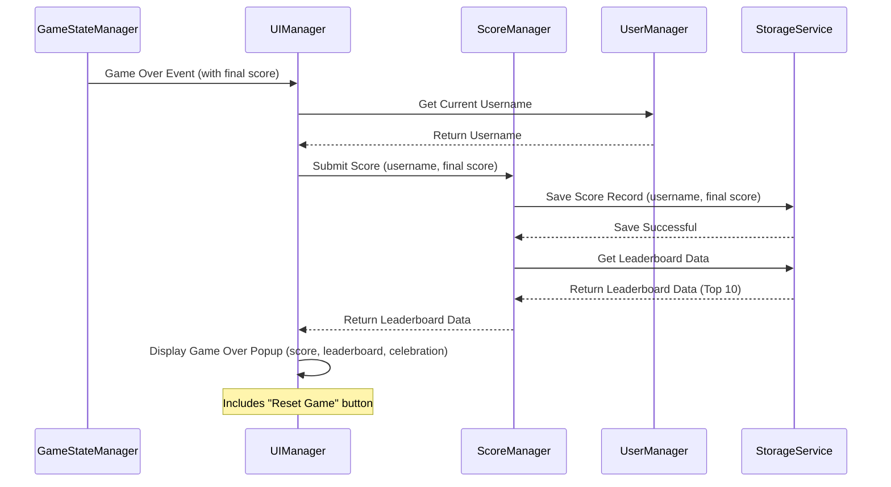
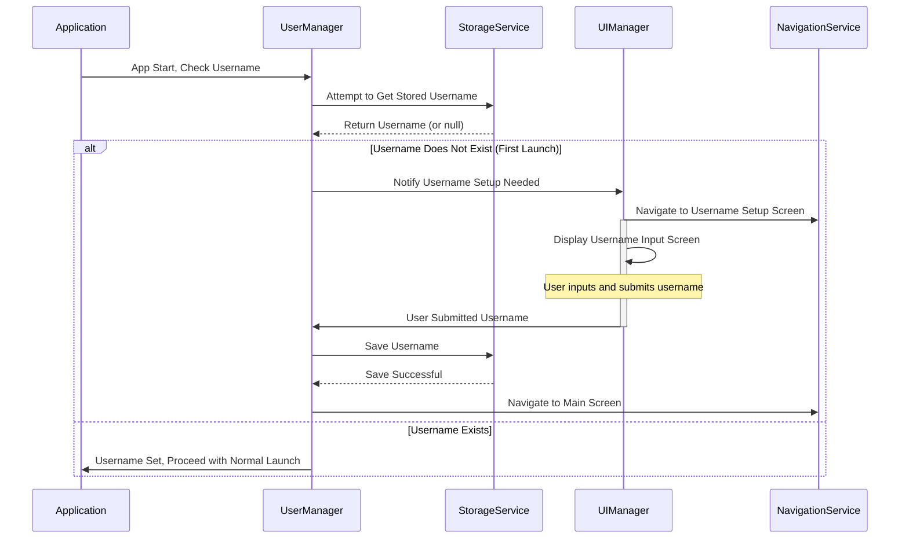
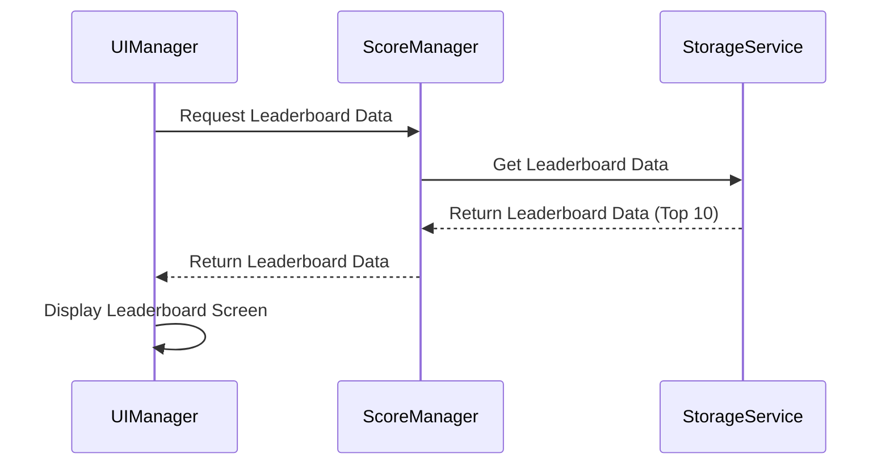
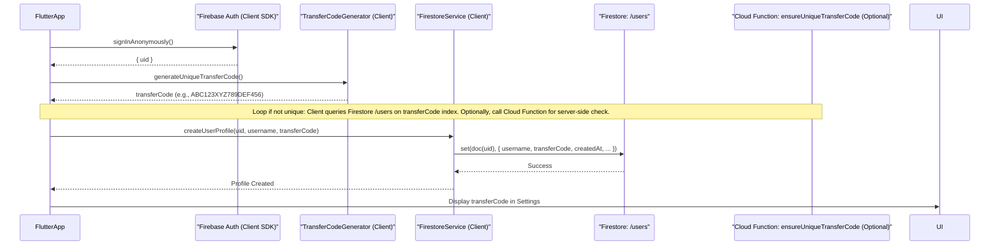
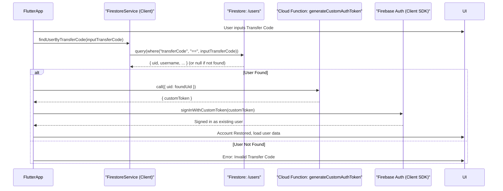
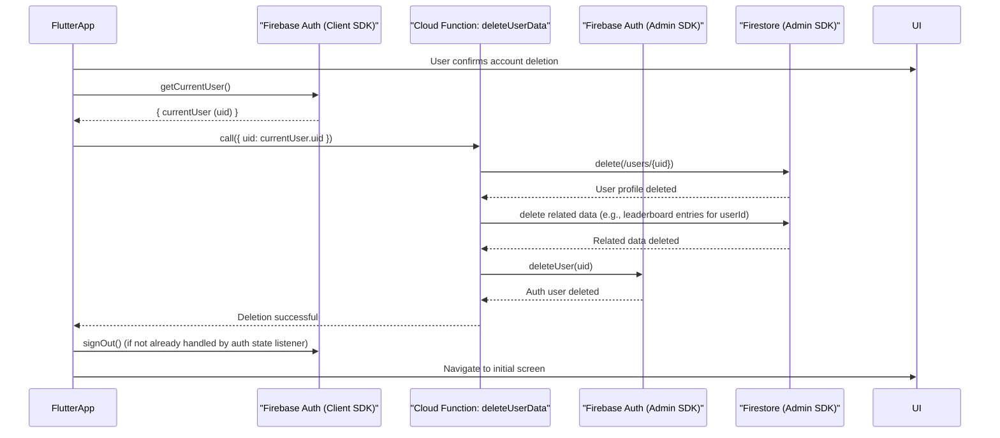
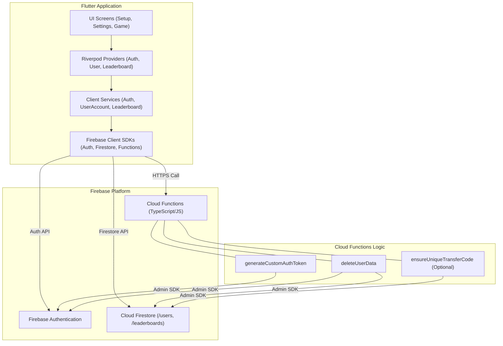

# Architecture Document

## 1. Overview

This document outlines the software architecture for the Yahtzee-style game application. It details the core components, their interactions, data models, and key architectural decisions.

## 2. Core Components and Interactions

The system is composed of the following core components:

*   **`UIManager`**:
    *   **Responsibilities**: Manages game over UI, first-time username setup, leaderboard display, and removal of third-party login UI elements.
    *   **Interactions**: Communicates with `GameStateManager`, `ScoreManager`, `UserManager`, and `NavigationService`.
*   **`GameStateManager`** (Extends [`lib/core_logic/game_state.dart`](lib/core_logic/game_state.dart) & [`lib/state_management/providers/game_providers.dart`](lib/state_management/providers/game_providers.dart)):
    *   **Responsibilities**: Detects game end, triggers game over events, manages game reset.
    *   **Interactions**: Notifies `UIManager` and `ScoreManager` on game end; resets game state.
*   **`ScoreManager`** (New):
    *   **Responsibilities**: Receives final scores, associates scores with usernames, interacts with `StorageService` for persistence, maintains leaderboard logic (top 10).
    *   **Interactions**: Gets scores from `GameStateManager`, username from `UserManager`, uses `StorageService` for data, provides leaderboard data to `UIManager`.
*   **`UserManager`** (New):
    *   **Responsibilities**: Manages username setup and retrieval, interacts with `StorageService` for persistence, handles first-launch username input flow with `UIManager`.
    *   **Interactions**: Uses `StorageService` for username data, provides username to `ScoreManager`, collaborates with `UIManager` for setup.
*   **`StorageService`** (Extends [`lib/services/local_storage_service.dart`](lib/services/local_storage_service.dart)):
    *   **Responsibilities**: Provides persistence for leaderboard data and usernames using `shared_preferences`.
    *   **Interactions**: Called by `ScoreManager` and `UserManager`.
*   **`ThirdPartyLoginRemover`** (Refactoring Task):
    *   **Responsibilities**: Identifies and removes all code, dependencies, and UI related to third-party logins.

## 3. Data Models

*   **`ScoreEntry`**:
    *   `username: String`
    *   `score: int`
    *   `timestamp: DateTime` (Optional)
*   **`Leaderboard`**:
    *   `scores: List<ScoreEntry>` (Top 10, sorted by score)
*   **`User`**:
    *   `username: String`

## 4. Process Flows (Mermaid)

### 4.1. Game Over Flow


### 4.2. First User Launch Flow


### 4.3. View Leaderboard Flow


## 5. Potential Impacts on Existing Code Structure

*   **[`lib/core_logic/game_state.dart`](lib/core_logic/game_state.dart)**: Add game end detection, event emission, and reset logic.
*   **[`lib/state_management/providers/game_providers.dart`](lib/state_management/providers/game_providers.dart)**: Update `GameStateNotifier`; potentially new providers for `ScoreManager`, `UserManager`.
*   **[`lib/services/local_storage_service.dart`](lib/services/local_storage_service.dart)**: Extend for `List<ScoreEntry>` and `String` (username) persistence via JSON serialization with `shared_preferences`.
*   **UI Screens** ([`lib/ui_screens/game_screen.dart`](lib/ui_screens/game_screen.dart), [`lib/ui_screens/home_screen.dart`](lib/ui_screens/home_screen.dart), new screens):
    *   `GameScreen`: Integrate game over popup.
    *   `HomeScreen`: Add leaderboard entry point. Implement display of current username in the AppBar. Modify "Continue Game" button visibility logic to be more robust (check `isGameInProgress` AND `currentTurn > 0`).
    *   New Screens: `UsernameSetupScreen`, `LeaderboardScreen`.
    *   Remove third-party login UI.
*   **[`lib/navigation/app_router.dart`](lib/navigation/app_router.dart)**: Add routes for new screens; logic for initial navigation to `UsernameSetupScreen`. The `redirect` logic will include a call to reset `GameState` via `gameStateProvider.notifier.setToInitialState()` after new user setup is complete and before navigating to the home screen.
*   **[`lib/main.dart`](lib/main.dart)**: Initial username check for routing.
*   **`pubspec.yaml`**: Remove third-party login dependencies.
*   **Platform-Specific Configs (Android/iOS)**: Remove third-party login configurations.

## 6. Removal of Third-Party Login

This involves a thorough audit and removal of:
*   Any Firebase Authentication methods used for third-party providers.
*   Dependencies like `google_sign_in`, `flutter_facebook_auth`, etc.
*   UI elements (buttons, settings) related to these login methods.
*   Associated logic in view models, services, or providers.
*   Platform-specific configurations (e.g., `google-services.json` entries, `Info.plist` modifications, URL schemes) if solely for these providers.

2025-05-24 11:01:51 - Initial architecture document for game over, leaderboard, username setup, and third-party login removal.

2025-05-24 12:43:15 - Updated HomeScreen UI details for username display and "Continue Game" button logic. Updated AppRouter to include GameState reset after new user setup.

## 7. Firebase Backend Integration and Transfer Code System

This section details the architecture for integrating Firebase as the backend for online features, including user identification via a transfer code system, data storage for user progress, and leaderboards.

### 7.1. Firebase Service Selection

*   **Firebase Authentication:**
    *   **Usage:** Primarily for anonymous authentication to obtain a stable Firebase UID for each user. This UID serves as the primary key for user-specific data in Firestore.
    *   **Transfer Code Linkage:** While users don't perform a traditional "login", their generated transfer code is linked to their anonymous Firebase UID. When restoring an account via a transfer code, the app will use a Cloud Function to generate a custom token for the original Firebase UID associated with that code, allowing the user to "sign in" as that existing anonymous user.
*   **Cloud Firestore:**
    *   **Usage:** Securely stores user profiles (including transfer codes), game data (high scores, ELO ratings, etc.), and global leaderboards.
    *   **Structure:** Data will be organized into collections like `users` and `leaderboards`.
*   **Cloud Functions:**
    *   **Usage:** To implement backend logic that cannot or should not be done on the client-side for security or operational reasons. This includes:
        *   Generating custom authentication tokens for account restoration.
        *   Securely deleting user data across Authentication and Firestore.
        *   Potentially, ensuring transfer code uniqueness if client-side checks are insufficient or for added robustness.

### 7.2. Data Models (Cloud Firestore)

*   **`users` Collection:**
    *   **Document ID:** Firebase UID (from Firebase Authentication)
    *   **Fields:**
        *   `username`: String (User-defined display name)
        *   `transferCode`: String (18-character uppercase alphanumeric, indexed for querying)
        *   `createdAt`: Timestamp (Server timestamp of user creation)
        *   `lastLoginAt`: Timestamp (Server timestamp of last login/restoration)
        *   `gameData`: Map
            *   `highScore`: Number
            *   `eloRating`: Number (default: e.g., 1200)
            *   `ladderRank`: Number (or String, depending on ranking system)
            *   `matchHistory`: Array (of maps, storing recent match details if needed)
            *   `otherStats`: Map (for any other game-specific persistent data)

*   **`transferCodes` Collection (Optional, for ensuring uniqueness and quick lookup):**
    *   **Document ID:** The transfer code itself (String)
    *   **Fields:**
        *   `uid`: String (The Firebase UID this transfer code belongs to)
        *   `createdAt`: Timestamp
    *   *Decision: Initially, we will query the `users` collection directly on the `transferCode` field with an index. If performance becomes an issue with a large number of users, this dedicated collection can be introduced.*

*   **`leaderboards` Collection:**
    *   **Document ID:** Represents a specific leaderboard (e.g., "global_yahtzee_high_score", "global_elo_ranking").
    *   **`scores` Subcollection:**
        *   **Document ID:** Auto-generated by Firestore (or could be the User's UID if only one entry per user is allowed per leaderboard type).
        *   **Fields:**
            *   `userId`: String (Firebase UID of the user, for joining with `users` collection if needed, though `username` is often denormalized)
            *   `username`: String (Denormalized for easy display on leaderboards)
            *   `score`: Number (The actual score value)
            *   `timestamp`: Timestamp (Server timestamp of when the score was achieved/submitted)
            *   `gameMode`: String (e.g., "YahtzeeClassic", "EloRanked") - If multiple leaderboards are managed under one parent doc.

### 7.3. Transfer Code System Flow

#### 7.3.1. New User Creation & Transfer Code Generation


#### 7.3.2. Account Restoration via Transfer Code

    **Security Considerations for Restoration:**
    *   **Rate Limiting:** Cloud Functions (`generateCustomAuthToken`) should have rate limiting to prevent brute-force attacks on transfer codes or UIDs.
    *   **Transfer Code Invalidation (Future Enhancement):** Consider invalidating a transfer code after it's successfully used and issuing a new one. This adds security but also complexity for the user. *Decision: For V1, codes are persistent unless the account is deleted. Logged in [`memory-bank/decisionLog.md`](memory-bank/decisionLog.md:1).*
    *   **Custom Token TTL:** Custom tokens generated by `generateCustomAuthToken` have a short lifespan (1 hour by default).

#### 7.3.3. User Data Deletion


### 7.4. Flutter Application & Firebase Interaction

*   **Service Layer (`lib/services/`):**
    *   `FirebaseService` (or similar initialization helper in `main.dart`): Initializes Firebase app.
    *   `AuthService` ([`lib/services/auth_service.dart`](lib/services/auth_service.dart)):
        *   `signInAnonymouslyIfNeeded()`: Ensures a Firebase UID.
        *   `signInWithTransferCode(transferCode)`: Orchestrates the restoration flow (calls Firestore query, then `generateCustomAuthToken` function, then `signInWithCustomToken`).
        *   `getCurrentUserId()`: Returns current Firebase UID.
        *   `signOut()`
    *   `UserAccountService` ([`lib/services/user_service.dart`](lib/services/user_service.dart:1)):
        *   `createUserProfile(uid, username, transferCode)`: Writes to `/users/{uid}`.
        *   `getUserProfile(uid)`: Reads `/users/{uid}`.
        *   `getTransferCodeForCurrentUser()`: Reads from current user's profile.
        *   `requestAccountDeletion()`: Calls `deleteUserData` Cloud Function.
    *   `LeaderboardService` ([`lib/services/leaderboard_service.dart`](lib/services/leaderboard_service.dart:1)):
        *   `submitScore(leaderboardId, score)`: Writes to `/leaderboards/{leaderboardId}/scores`.
        *   `getLeaderboard(leaderboardId, limit)`: Reads from `/leaderboards/{leaderboardId}/scores`.
    *   `TransferCodeGenerator` ([`lib/utils/transfer_code_generator.dart`](lib/utils/transfer_code_generator.dart)):
        *   `generateUniqueTransferCode()`: Generates an 18-character code. Client-side uniqueness check by querying Firestore before finalizing.

*   **Data Models (Flutter Client - `lib/models/`):**
    *   `UserModel.dart`: Maps to the `users` collection document structure. Includes `fromJson`, `toJson`.
    *   `LeaderboardEntry.dart`: Maps to a document in the `scores` subcollection. Includes `fromJson`, `toJson`.

*   **UI Components & Screens:**
    *   [`lib/ui_screens/username_setup_screen.dart`](lib/ui_screens/username_setup_screen.dart:1): Modified to include "Restore with Transfer Code" option. Input field for transfer code.
    *   [`lib/ui_screens/settings_screen.dart`](lib/ui_screens/settings_screen.dart:1): Displays current user's transfer code (with copy button). "Delete Account" button.

*   **State Management (Riverpod - `lib/state_management/providers/`):**
    *   `firebaseAuthProvider`: Provides `Stream<User?>` from `FirebaseAuth.instance.authStateChanges()`.
    *   `authServiceProvider`: Provides `AuthService` instance.
    *   `userAccountProvider`: Provides `UserAccountService` instance. May provide `Stream<UserModel?>` for the current user.
    *   `transferCodeProvider`: Provides the current user's transfer code (String?).
    *   `leaderboardServiceProvider`: Provides `LeaderboardService` instance.
    *   `specificLeaderboardProvider(String leaderboardId)`: Family provider for specific leaderboards.

### 7.5. Cloud Functions (TypeScript/JavaScript - in `functions/` directory)

*   **`generateCustomAuthToken(data: { uid: string }, context)`:**
    *   Callable Function.
    *   Input: `uid`.
    *   Action: Verifies UID if necessary (e.g., check if user exists in Firestore). Uses Firebase Admin SDK to `admin.auth().createCustomToken(uid)`.
    *   Output: `{ customToken: string }`.
*   **`deleteUserData(data: { uid: string }, context)`:**
    *   Callable Function.
    *   Input: `uid`. Requires `context.auth` to ensure the caller is authenticated (though the UID to delete is passed in `data`). Further checks might be needed to ensure a user can only request their own data deletion unless it's an admin function.
    *   Action:
        1.  Delete Firestore document at `/users/{uid}`.
        2.  Query and delete all entries in `/leaderboards/{any_id}/scores` where `userId == uid`.
        3.  Use Firebase Admin SDK `admin.auth().deleteUser(uid)`.
    *   Output: `{ success: boolean }`.
*   **`ensureUniqueTransferCode(data: { transferCode: string }, context)` (Optional - if client-side check is deemed insufficient):**
    *   Callable Function.
    *   Input: `transferCode`.
    *   Action: Queries `/users` collection for the given `transferCode`.
    *   Output: `{ isUnique: boolean }`.

### 7.6. API Interfaces (Flutter calling Cloud Functions)

Flutter app uses the `cloud_functions` package.
Example:
```dart
// In AuthService or UserAccountService
final HttpsCallable callable = FirebaseFunctions.instance.httpsCallable('generateCustomAuthToken');
final HttpsCallableResult result = await callable.call<Map<String, dynamic>>({'uid': userId});
final String customToken = result.data['customToken'];
```

### 7.7. Data Synchronization, Offline Support, Error Handling

*   **Data Synchronization:** Firestore provides real-time synchronization for listeners. For one-time reads, data is current at the time of request.
*   **Offline Support:** Firestore client SDK provides offline persistence. Reads can be served from cache, and writes are queued and sent when online. This is suitable for user profiles and non-critical leaderboard submissions. Critical operations might need explicit online checks.
*   **Error Handling:**
    *   Client-side: Wrap all Firebase calls in `try-catch` blocks. Handle `FirebaseException` and specific error codes. Provide user-friendly messages.
    *   Cloud Functions: Robust error handling within each function. Use `HttpsError` for callable functions to send structured errors back to the client. Log errors using `functions.logger`.

### 7.8. Overall Firebase Architecture Diagram


2025-05-24 14:02:00 - Added Firebase Backend Integration and Transfer Code System architecture.

2025-05-25 05:42:00 - Updated [`lib/main.dart`](lib/main.dart:1) description in section 5 to reflect the implementation of Firebase anonymous sign-in on app startup. This ensures `currentUser` is available before critical operations needing authentication.