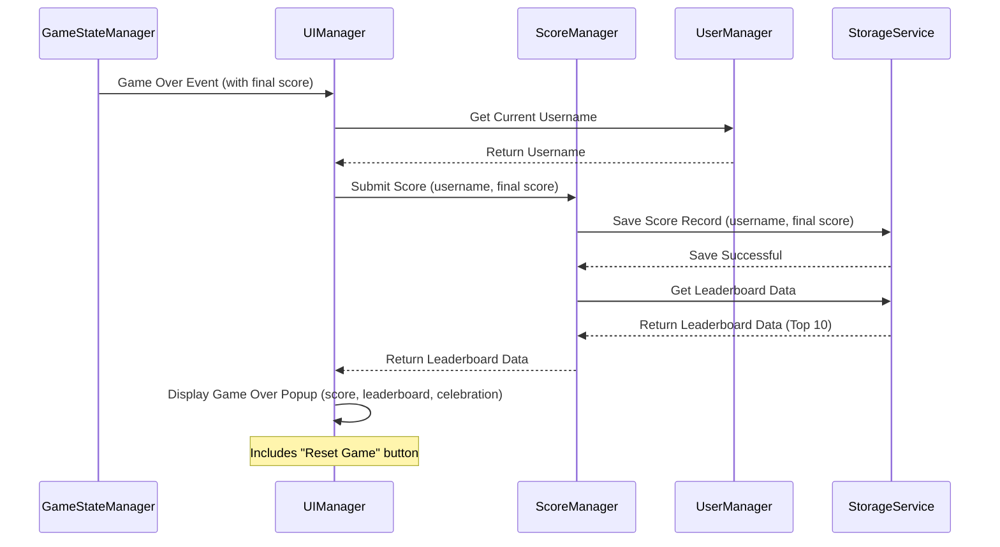
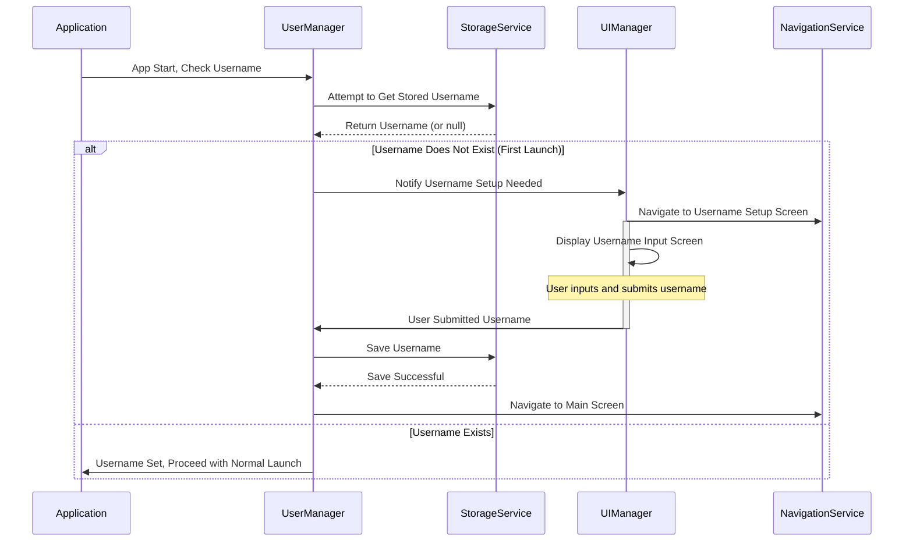
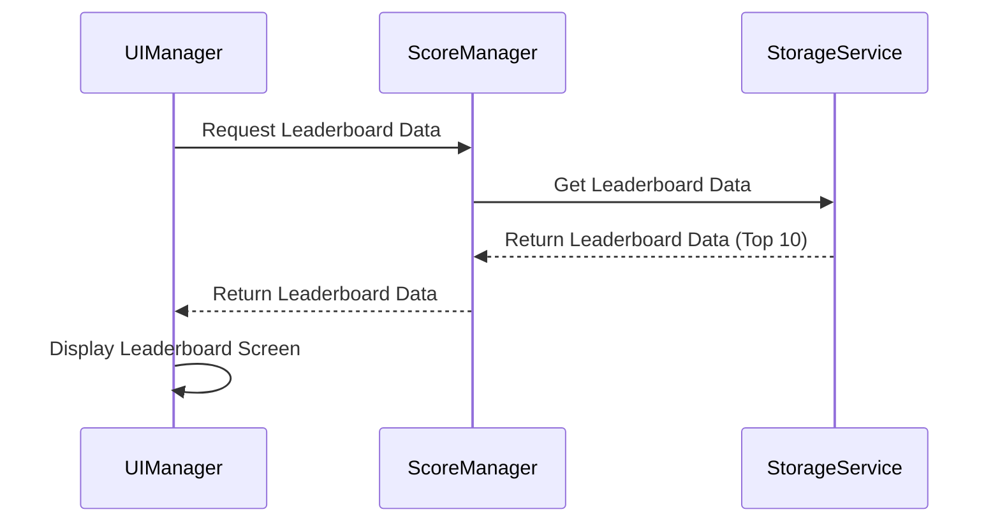

# Architecture Document

## 1. Overview

This document outlines the software architecture for the Yahtzee-style game application. It details the core components, their interactions, data models, and key architectural decisions.

## 2. Core Components and Interactions

The system is composed of the following core components:

*   **`UIManager`**:
    *   **Responsibilities**: Manages game over UI, first-time username setup, leaderboard display, and removal of third-party login UI elements.
    *   **Interactions**: Communicates with `GameStateManager`, `ScoreManager`, `UserManager`, and `NavigationService`.
*   **`GameStateManager`** (Extends [`lib/core_logic/game_state.dart`](lib/core_logic/game_state.dart) & [`lib/state_management/providers/game_providers.dart`](lib/state_management/providers/game_providers.dart)):
    *   **Responsibilities**: Detects game end, triggers game over events, manages game reset.
    *   **Interactions**: Notifies `UIManager` and `ScoreManager` on game end; resets game state.
*   **`ScoreManager`** (New):
    *   **Responsibilities**: Receives final scores, associates scores with usernames, interacts with `StorageService` for persistence, maintains leaderboard logic (top 10).
    *   **Interactions**: Gets scores from `GameStateManager`, username from `UserManager`, uses `StorageService` for data, provides leaderboard data to `UIManager`.
*   **`UserManager`** (New):
    *   **Responsibilities**: Manages username setup and retrieval, interacts with `StorageService` for persistence, handles first-launch username input flow with `UIManager`.
    *   **Interactions**: Uses `StorageService` for username data, provides username to `ScoreManager`, collaborates with `UIManager` for setup.
*   **`StorageService`** (Extends [`lib/services/local_storage_service.dart`](lib/services/local_storage_service.dart)):
    *   **Responsibilities**: Provides persistence for leaderboard data and usernames using `shared_preferences`.
    *   **Interactions**: Called by `ScoreManager` and `UserManager`.
*   **`ThirdPartyLoginRemover`** (Refactoring Task):
    *   **Responsibilities**: Identifies and removes all code, dependencies, and UI related to third-party logins.

## 3. Data Models

*   **`ScoreEntry`**:
    *   `username: String`
    *   `score: int`
    *   `timestamp: DateTime` (Optional)
*   **`Leaderboard`**:
    *   `scores: List<ScoreEntry>` (Top 10, sorted by score)
*   **`User`**:
    *   `username: String`

## 4. Process Flows (Mermaid)

### 4.1. Game Over Flow

### 4.2. First User Launch Flow

### 4.3. View Leaderboard Flow

## 5. Potential Impacts on Existing Code Structure

*   **[`lib/core_logic/game_state.dart`](lib/core_logic/game_state.dart)**: Add game end detection, event emission, and reset logic.
*   **[`lib/state_management/providers/game_providers.dart`](lib/state_management/providers/game_providers.dart)**: Update `GameStateNotifier`; potentially new providers for `ScoreManager`, `UserManager`.
*   **[`lib/services/local_storage_service.dart`](lib/services/local_storage_service.dart)**: Extend for `List<ScoreEntry>` and `String` (username) persistence via JSON serialization with `shared_preferences`.
*   **UI Screens** ([`lib/ui_screens/game_screen.dart`](lib/ui_screens/game_screen.dart), [`lib/ui_screens/home_screen.dart`](lib/ui_screens/home_screen.dart), new screens):
    *   `GameScreen`: Integrate game over popup.
    *   `HomeScreen`: Add leaderboard entry point. Implement display of current username in the AppBar. Modify "Continue Game" button visibility logic to be more robust (check `isGameInProgress` AND `currentTurn > 0`).
    *   New Screens: `UsernameSetupScreen`, `LeaderboardScreen`.
    *   Remove third-party login UI.
*   **[`lib/navigation/app_router.dart`](lib/navigation/app_router.dart)**: Add routes for new screens; logic for initial navigation to `UsernameSetupScreen`. The `redirect` logic will include a call to reset `GameState` via `gameStateProvider.notifier.setToInitialState()` after new user setup is complete and before navigating to the home screen.
*   **[`lib/main.dart`](lib/main.dart)**: Initial username check for routing.
*   **`pubspec.yaml`**: Remove third-party login dependencies.
*   **Platform-Specific Configs (Android/iOS)**: Remove third-party login configurations.

## 6. Removal of Third-Party Login

This involves a thorough audit and removal of:
*   Any Firebase Authentication methods used for third-party providers.
*   Dependencies like `google_sign_in`, `flutter_facebook_auth`, etc.
*   UI elements (buttons, settings) related to these login methods.
*   Associated logic in view models, services, or providers.
*   Platform-specific configurations (e.g., `google-services.json` entries, `Info.plist` modifications, URL schemes) if solely for these providers.

2025-05-24 11:01:51 - Initial architecture document for game over, leaderboard, username setup, and third-party login removal.

2025-05-24 12:43:15 - Updated HomeScreen UI details for username display and "Continue Game" button logic. Updated AppRouter to include GameState reset after new user setup.